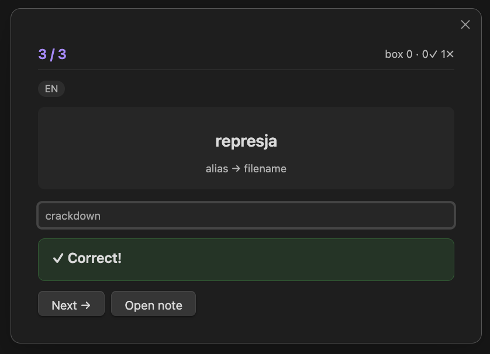
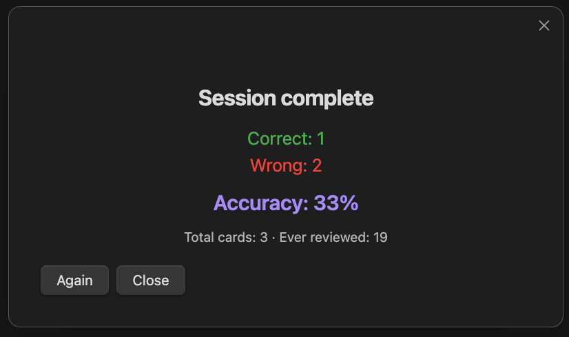

  

<h1 align="center">Symbolink</h1>

An Obsidian plugin that turns your vault into a flashcard review system using note properties.

**How it works:**

Your frontmatter properties (`nodes`, `tags`, `image`, `alias`) become hints. The answer is always the filename (without extension). Symbolink uses a Leitner box system for spaced repetition so you review what you need, when you need it.

## Features

- **Type-in answers** instead of just flipping cards
- **Spaced repetition** with 7 Leitner boxes (0, 1, 3, 7, 14, 30, 60 day intervals)
- **Multiple hint types:** nodes, tags, images, aliases
- **Language filtering** via `_lang/*` tags (e.g. `_lang/EN`, `_lang/PL`)
- **Field filtering** via `_field/*` tags (e.g. `_field/architecture`, `_field/painting`)
- **Exclude cards** by tagging them with `_category/*` — they won't appear in study at all
- **Fuzzy matching** that ignores case and diacritics
- **Works on mobile** (iOS and Android)
- **Review data stored separately** in the plugin's `data.json`, your notes are never modified

## Screenshots

  
  

## Supported frontmatter properties

| Property | Role | Example |
|----------|------|---------|
| `nodes` | List of hints (displayed as clues) | `[tree, Canada, syrup]` |
| `tags` | Additional hints (tags starting with `_` are excluded from display) | `[acer, autumn]` |
| `image` | Path to an image displayed as a visual hint | `assets/photo.png` |
| `alias` / `aliases` | Alternative names; shown as hint, answer is still the filename | `[maple, ahorn]` |

### Special tags

| Tag | Effect |
|-----|--------|
| `_category/X` | **Excludes** the card from study entirely |
| `_lang/EN`, `_lang/PL`, etc. | Language label — used as a session filter and shown as a badge |
| `_field/architecture`, `_field/painting`, etc. | Field/domain label — used as a session filter and shown as a badge |

All `_` prefixed tags are hidden from the hint display.

## Installation

### Manual

1. Download the latest release (or clone this repo)
2. Copy `main.js`, `styles.css`, and `manifest.json` into your vault at `.obsidian/plugins/symbolink/`
3. Open Obsidian Settings → Community plugins → Enable "Symbolink"

## Usage

- **Command palette:** `Symbolink: Start review` or `Symbolink: Review stats`
- **Ribbon icon:** Click the layers icon in the left sidebar
- **Keyboard:** Press `Enter` to check your answer, then `Enter` again to go to the next card

## Settings

| Setting | Description | Default |
|---------|-------------|---------|
| Cards per session | Number of cards per review session | 20 |
| Show nodes | Display nodes as hints | On |
| Show tags | Display tags as hints | On |
| Show image | Display image as a visual hint | On |
| Fuzzy matching | Ignore case and diacritics | On |
| Filter by folder | Only include notes from a specific folder | (empty = all) |
| Default language filter | Pre-select a `_lang/*` value in the session menu | (empty = all) |
| Default field filter | Pre-select a `_field/*` value in the session menu | (empty = all) |

## How the algorithm works

Symbolink uses a simplified Leitner box system:

- Each card starts at **Box 0**
- Correct answer → card moves up one box
- Wrong answer → card moves down one box
- Each box has an interval: 0, 1, 3, 7, 14, 30, 60 days
- Cards are selected by priority: overdue cards and cards with high error rates come first
- New (never reviewed) cards have the highest priority

## License

MIT
